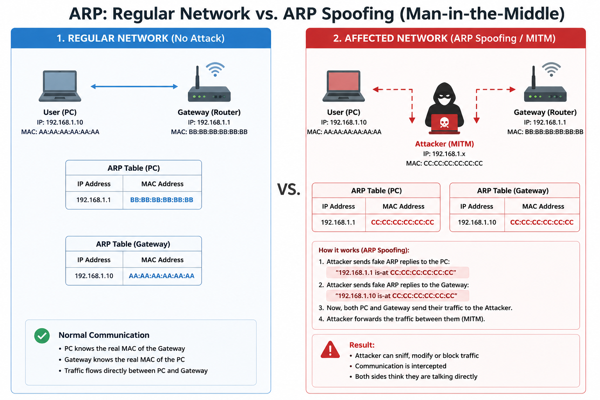

## Day 1 - Bad Day
**0/3 Nothing**
- Reading:
    1. I try to read it, but I can't understand when I currenty in the class.
    2. I read but I don't absorve any concept.
- Code:
    1. Start the script, but I need admin acess on the collage PC.
- Wireshark:
    1. I also need to have admin permissions to install it.
 
## Day 2 - Arch Linux install
1. Verify network
    ```bash
    ping google.com
    ````
2. Verify updates
    ```bash
    pacman -Syy
    pacman-key --init
    pacman-key --populate archlinux
    pacman -Sy archlinux-keyring
    ````
3. Install configs
    ```bash
    archinstall --skip-ntp --skip-wkd
    ````
## Day 3 - Using Archcraft and Sniffing Networks

### Tools

| Tool | Description | Install |
|------|-------------|---------|
| **Wireshark** | GUI-based packet analyzer — lets you capture and inspect network traffic in real time | `sudo pacman -S wireshark-qt` |
| **nmap** | Network scanner — discovers hosts, open ports, and services on a network | `sudo pacman -S nmap` |
| **ettercap** | MitM attack framework — intercepts traffic between two hosts on the same network | `sudo pacman -S ettercap-text-only` |

---

### 1. Discover Targets on the Network

```bash
sudo nmap -sn 192.168.1.0/24
```

| Part | Meaning |
|------|---------|
| `sudo` | Required — raw packet scanning needs root privileges |
| `-sn` | "Ping scan" — skips port scanning, only checks which hosts are alive |
| `192.168.1.0/24` | The subnet to scan — replace with your actual network range (e.g. `192.168.0.0/24`). The `/24` means all 256 addresses in that range |
---

### 2. MitM Attack with Ettercap (ARP Poisoning)

```bash
sudo ettercap -T -S -i wlan0 -M arp:remote /192.168.1.x// /192.168.1.y//
```

| Flag / Part | Meaning |
|-------------|---------|
| `-T` | **Text-only mode** — runs ettercap in the terminal instead of a GUI |
| `-S` | **No SSL** — disables SSL interception (avoids certificate errors crashing the session) |
| `-i wlan0` | **Interface** — the network adapter to use. Replace `wlan0` with your actual interface (check with `ip a`). Could be `eth0`, `wlan1`, etc. |
| `-M arp:remote` | **MitM method** — uses ARP poisoning in remote mode, meaning traffic is forwarded after capture (so the victim stays connected) |
| `/192.168.1.x//` | **Target 1 (victim)** — replace `x` with the last octet of the victim's IP (e.g. `/192.168.1.105//`) |
| `/192.168.1.y//` | **Target 2 (gateway/router)** — replace `y` with the router's IP (commonly `.1`, e.g. `/192.168.1.1//`) |
| `//` | The double slashes are ettercap's syntax for "all ports" on that host |

---

### 3. How ARP Poisoning Works



ARP (Address Resolution Protocol) maps IP addresses to MAC addresses on a local network.
In an ARP poisoning attack, the attacker sends **fake ARP replies** to both the victim and
the router, making each one believe the attacker's MAC address belongs to the other.
This places the attacker **in the middle** of all traffic between them.

--- 